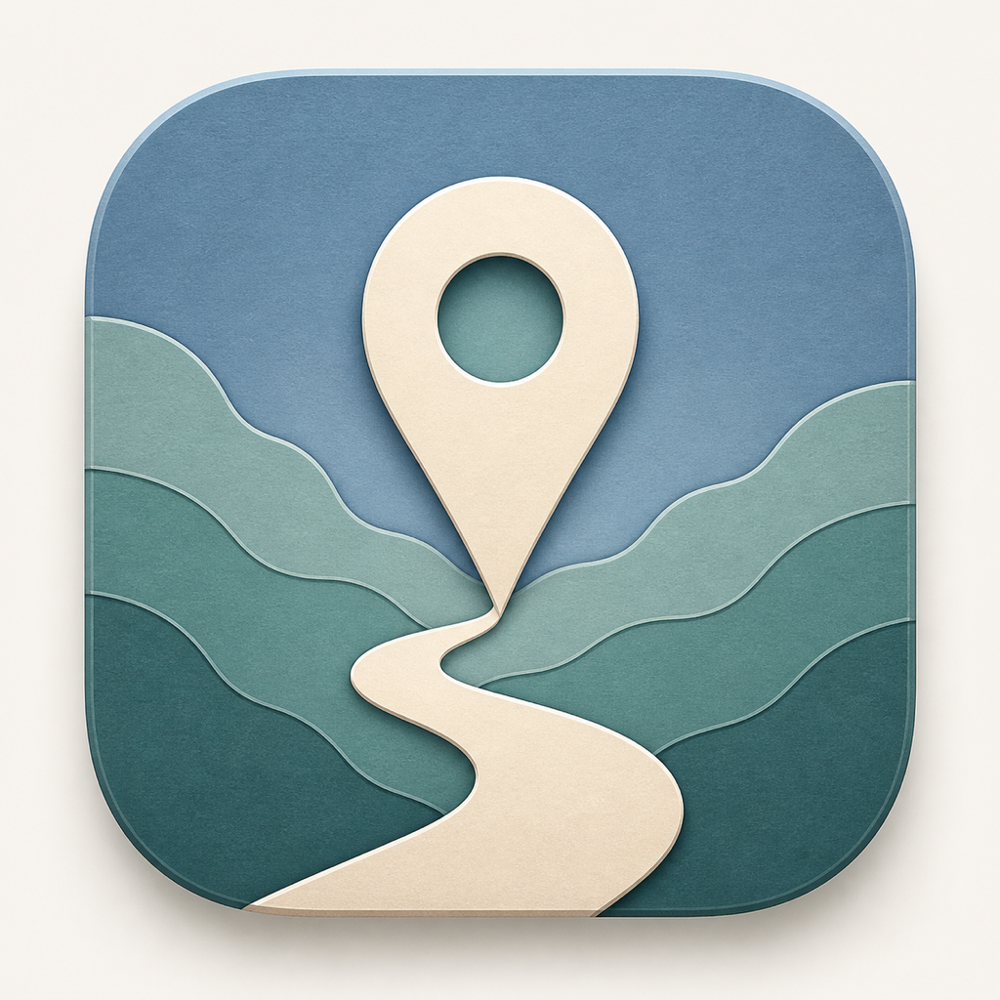

<p align="center">
  
</p>

<h1 align="center">Ghostpin</h1>

<p align="center">
  <strong>A native macOS workspace for simulating an iPhone's location.</strong><br>
  Rootless userspace tunnel on modern iOS, no jailbreak, and no API key.
</p>

<p align="center">
  
  
  
  <a href="https://github.com/Kron00/ghostpin/actions/workflows/ci.yml"></a>
</p>

Ghostpin uses Apple's developer location-simulation service through
[pymobiledevice3](https://github.com/doronz88/pymobiledevice3). The Mac runs the
app and a connected iPhone is the target. Location changes are system-wide and
remain active until reset or the developer connection ends.

> **Use this on hardware you own.** Simulating a device's location requires
> Developer Mode and an established trust relationship, so Ghostpin can only
> control a phone you have already unlocked and paired. Please read
> [Responsible use](#responsible-use) before you start.

## Features

- Click-to-spoof and one-click teleport mode
- Locally biased Google Maps place search with coordinate and OSM fallback
- **Routes with any number of stops**, filled from the search bar or by
  pointing at the map, reorderable, and optionally closing the loop
- **Roam**: pick a centre and a radius and wander the real road network
  inside it at random, indefinitely
- **Adaptive speed** that follows posted limits from OpenStreetMap and eases
  off at stop signs and traffic signals
- WASD/arrow-key joystick control
- Saved and recent locations, profiles, schedules, and route history
- Multi-device selection over USB or paired Wi-Fi
- Cooldown, GPS jitter, IP/GPS mismatch, and timezone guidance
- Dark and light cartographic themes in a native pywebview window

## Requirements

- macOS 10.15 or newer
- Python 3.10 or newer, only if running from source — Homebrew Python 3.12 or
  3.13 recommended
- An iPhone running iOS 17 or newer with Developer Mode enabled
- A trust relationship between the iPhone and the Mac

## Install

### From a release

Download the DMG from the
[latest release](https://github.com/Kron00/ghostpin/releases/latest), open it,
and drag Ghostpin to Applications.

The app is signed ad-hoc rather than notarized, so the first launch needs an
override: right-click Ghostpin in Applications, choose **Open**, then confirm.
Double-clicking it the first time will be blocked by Gatekeeper.

### From source

```bash
git clone https://github.com/Kron00/ghostpin.git
cd ghostpin
./start.sh
```

`start.sh` creates or reuses `.venv`, installs the pinned dependencies, and opens
the UI at `127.0.0.1:8080`. It does not need `sudo` for modern devices.

### Enabling Developer Mode on the iPhone

1. Connect the iPhone to the Mac and tap **Trust** on the device.
2. Go to **Settings → Privacy & Security → Developer Mode**, turn it on, and let
   the phone restart.
3. Confirm the prompt after the restart.

Developer Mode only appears in Settings after the phone has been connected to a
Mac running a developer tool at least once. If you do not see it, launch
Ghostpin with the phone connected and check again.

## How the connection works

Ghostpin targets pymobiledevice3 10.3.1. On iOS 17.4 and newer it creates a
pure-Python userspace RSD tunnel inside the app process, so normal operation
does not require root or an administrator password. During connection it also:

1. Discovers trusted devices through usbmux.
2. Verifies Developer Mode.
3. Checks for a mounted Developer Disk Image and auto-mounts one if needed.
4. Opens DVT and its location-simulation channel.
5. Falls back to privileged `tunneld` only if userspace tunnel/RSD creation
   itself fails.

The location keep-alive serializes all DVT writes and reasserts the current
coordinate once per second while the phone remains connected.

## Location and search

At launch, Ghostpin centers the map on a separately styled blue marker for the
Mac's approximate network location. This does not set or simulate the iPhone's
location. The last known area is retained locally for offline startup.

Search uses Google Maps' keyless web autocomplete as its primary place source.
Because that endpoint is unofficial, Photon and Nominatim run as automatic
fallbacks if Google changes or throttles it.

## Privacy

Ghostpin has no backend, no account, and no telemetry. Nothing is sent to any
server operated by this project, and no analytics or crash reporting is
included.

It does talk to third parties for maps and search. What leaves your machine:

| Service | What is sent |
| --- | --- |
| CARTO basemap tiles | Tile coordinates for every area you view on the map |
| Google Maps autocomplete (keyless) | Your search query, the visible map center, and zoom |
| Google Maps directions | Origin and destination addresses you enter for a route |
| Photon, Nominatim | Your search query and the visible map center, as search fallbacks |
| OSRM | Route waypoint coordinates, when a route has no precalculated geometry |
| ipwho.is, ipinfo.io | Nothing but the request itself; your public IP is implicit, and the response is your approximate city used to place the startup marker |
| unpkg CDN | The Leaflet library, fetched with subresource integrity |

No device UDID, and no location you have set on the phone, is ever sent to a
third party.

Everything Ghostpin stores stays in
`~/Library/Application Support/Ghostpin/` — saved locations, profiles,
schedules, route history, and the webview's local storage. On first launch it
copies existing data from the upstream app's support directory so your saved
places carry over. Nothing is encrypted at rest, so treat that directory as
sensitive: it is a log of places you have been interested in.

The local API is unauthenticated, which is safe because the server binds to
`127.0.0.1` and rejects cross-origin writes. See [SECURITY.md](SECURITY.md).

## Responsible use

Ghostpin is a developer tool. It is genuinely useful for testing
location-aware apps, capturing demos and screenshots without traveling,
validating geofences, and keeping your real whereabouts out of apps that do not
need them.

It is not a tool for deceiving people, and some uses of it are crimes:

- **Do not use it on a device that is not yours.** Installing this against
  someone else's phone to monitor or mislead them is stalking, and it is illegal
  nearly everywhere.
- **Do not use it to commit fraud.** Faking your location to claim benefits,
  defeat licensing or betting restrictions, manipulate insurance telematics, or
  forge a delivery or timekeeping record is fraud regardless of the tool.
- **Expect it to violate terms of service.** Games, dating apps, ride-hailing,
  and delivery platforms generally prohibit location spoofing and do ban
  accounts for it. The cooldown, jitter, and IP-mismatch warnings exist to stop
  you producing physically impossible traces — they are not a guarantee, and
  they are not an evasion feature.
- **Do not spoof safety-critical location data.** Never do this on a device that
  might be used to call emergency services; emergency dispatch may receive the
  simulated position.

Location changes are system-wide and persist until you reset. Reset before you
need your real location for anything that matters.

You are responsible for how you use this software. The authors provide it as-is,
with no warranty, and accept no liability for misuse — see [LICENSE](LICENSE).

## Troubleshooting

**Device does not appear.** Confirm the cable carries data, that you tapped
Trust on the phone, and that Developer Mode is on. Unlock the phone before
connecting.

**"Developer Mode not enabled" after enabling it.** The phone must restart and
you must confirm the prompt after the restart. Reconnect afterward.

**Developer Disk Image fails to mount.** Ghostpin downloads and mounts an image
matching your iOS version. This needs an internet connection and can fail on a
brand-new iOS release before an image is published. Updating
`pymobiledevice3` often resolves it.

**Ghostpin asks for an administrator password.** That means the userspace tunnel
failed and it fell back to privileged `tunneld`. It is expected on iOS below
17.4 and unexpected above it — please file an issue with your iOS version.

**Location does not change in an app.** Some apps cache the last fix. Force-quit
and reopen the app on the phone. Others cross-check against your IP address; the
mismatch banner in Ghostpin will tell you when that is likely.

**The spoof stops when I disconnect.** That is by design. The simulated location
only holds while the developer connection is live.

## Development

Run the development server:

```bash
./start.sh
```

Build the native app and DMG:

```bash
./build.sh
```

Outputs:

```text
dist/Ghostpin.app
dist/Ghostpin-2.1.0.dmg
```

See [CONTRIBUTING.md](CONTRIBUTING.md) for the full contributor guide, including
the rule against committing device screenshots.

### Windows

Ghostpin is developed and tested on macOS only. `start.bat` and
`build_windows.bat` are included as a starting point for anyone who wants to
take Windows support on, but they are **unmaintained and known to be
incomplete** — the Windows build omits imports the iOS 17.4+ connection path
needs, and the dev script launches the tunnel fallback without elevation. Bug
reports against them will be closed unless they come with a fix.

## Project structure

```text
app.py                 Flask API
device_manager.py      usbmux discovery, userspace tunnel, DDI, DVT
location_service.py    location, keep-alive, movement, routes, persistence
tunnel_service.py      privileged compatibility fallback
main_app.py            native pywebview entry point
templates/index.html   application workspace
static/css/style.css   Ghostpin cartographic visual system
static/js/app.js       map and interaction logic
icon.png               original Ghostpin app icon
build.sh               macOS app and DMG build
```

## License and upstream attribution

Ghostpin is a modified work based on Gabriel Vuksani's
[iPhone Location Spoofer](https://github.com/gabrielvuksani/iphonespoofer).
The upstream copyright notice and MIT license are preserved in [LICENSE](LICENSE)
and the modification attribution is recorded in [NOTICE.md](NOTICE.md). Built
application bundles include both files.

The Ghostpin name, icon, cartographic theme, userspace-tunnel integration, and
iOS 27 compatibility changes are original to this fork.
